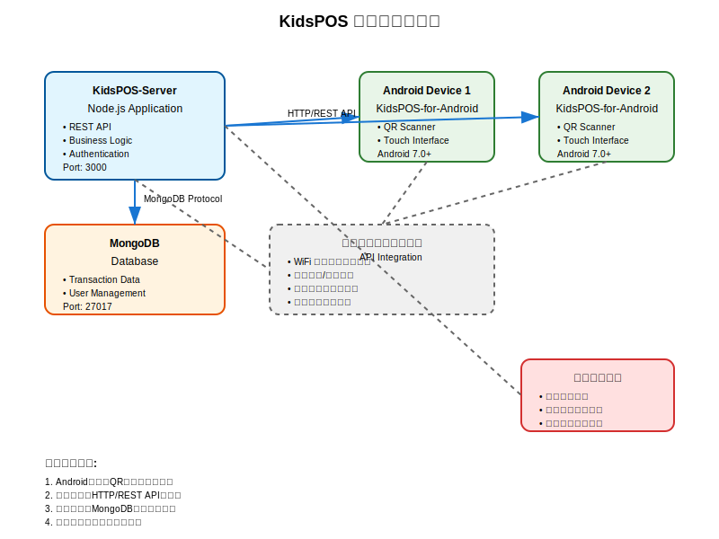

# KidsPOS システム現場展開研修

**実際の現場でのシステム導入手順**

---

## 研修の目的

- **KidsPOSシステムの理解** - システム全体の構成と役割
- **展開手順の習得** - 実際の現場での設置方法
- **トラブルシューティング** - 問題発生時の対応方法
- **運用ノウハウ** - 安定した運用のためのベストプラクティス

---

## システム構成概要



### 主要コンポーネント
- **KidsPOS-Server**
  - Node.js + MongoDB
  - ポート3000で稼働
- **KidsPOS-for-Android**
  - Android 7.0以上対応
  - WiFi接続必須

---

## 展開フェーズ

### 📋 フェーズ1: 事前準備
- 要件確認
- ハードウェア準備
- ネットワーク設計
- セキュリティ計画

### 🔧 フェーズ2: サーバー構築
- OS・ミドルウェアインストール
- データベース設定
- アプリケーション展開

---

## フェーズ1: 事前準備

### ✅ 要件確認チェックリスト
- [ ] 展開場所のネットワーク環境
- [ ] 電源供給の安定性
- [ ] 使用するAndroidデバイス台数
- [ ] 運用スタッフの技術レベル
- [ ] セキュリティ要件

### 📱 推奨デバイス仕様
- **タブレット**: 8インチ以上
- **RAM**: 4GB以上
- **Android**: 7.0以上

---

## フェーズ2: サーバー環境構築

### 🖥️ システム要件
```bash
OS: Ubuntu 20.04 LTS
CPU: 2コア以上
メモリ: 4GB以上
ストレージ: 50GB以上
```

### 📦 必要ソフトウェア
- Node.js 14.x以上
- MongoDB 4.4以上
- PM2 (プロセス管理)
- Git

---

## サーバー設定のポイント

### 🔒 セキュリティ設定
```bash
# ファイアウォール設定
sudo ufw allow 3000/tcp
sudo ufw allow ssh
sudo ufw --force enable
```

### 🔧 環境設定
```env
MONGODB_URI=mongodb://localhost:27017/kidspos
PORT=3000
NODE_ENV=production
JWT_SECRET=your-super-secret-key
```

---

## フェーズ3: Android端末設定

### 📱 デバイス設定手順
1. **開発者オプション有効化**
   - 設定 → デバイス情報 → ビルド番号を7回タップ

2. **提供元不明のアプリ許可**
   - 設定 → セキュリティ → 提供元不明のアプリ

3. **権限設定**
   - カメラ、ストレージ、ネットワーク

---

## APKインストール方法

### 方法1: ADB経由
```bash
adb devices
adb install app-release.apk
```

### 方法2: 直接インストール
1. APKファイルをデバイスに転送
2. ファイルマネージャーで開く
3. インストール実行

### 方法3: HTTP配布
```bash
python3 -m http.server 8080
# ブラウザで http://[IP]:8080/app-release.apk
```

---

## フェーズ4: 統合テスト

### 🧪 テスト項目
- [ ] **通信テスト** - サーバーとの接続確認
- [ ] **機能テスト** - QRコード読み取り等
- [ ] **負荷テスト** - 複数端末同時接続
- [ ] **セキュリティテスト** - 不正アクセス対策

### 📊 性能確認
```bash
# メモリ使用量
adb shell dumpsys meminfo [package]
# CPU使用率  
adb shell top | grep [package]
```

---

## よくあるトラブルとその対策

### 🚫 問題1: アプリがインストールできない
**原因**: 署名エラー、ストレージ不足
**対策**: 
```bash
keytool -printcert -jarfile app-release.apk
adb shell df -h
```

### 🔌 問題2: サーバーに接続できない
**原因**: ネットワーク設定、ファイアウォール
**対策**:
```bash
adb shell ping [サーバーIP]
adb shell nc -zv [サーバーIP] 3000
```

---

## 運用開始前の最終確認

### 📋 本番チェックリスト
- [ ] 全端末での動作確認
- [ ] データ同期テスト
- [ ] バックアップ設定
- [ ] 監視設定
- [ ] スタッフ研修完了
- [ ] 緊急時対応手順書準備

### 🎯 成功のポイント
- **段階的展開**: 少数端末から開始
- **十分なテスト**: 本番前の徹底検証
- **スタッフ教育**: 操作方法の周知徹底

---

## 運用中の監視

### 📊 監視項目
```bash
# システム状態
pm2 status
sudo systemctl status mongod

# リソース使用量
htop
df -h
free -h

# アプリケーションログ
pm2 logs kidspos-server
```

### 🔄 定期メンテナンス
- 週次: ログファイルの確認
- 月次: バックアップの検証
- 四半期: システムアップデート

---

## 緊急時対応

### 🚨 緊急時の対応手順

1. **問題の切り分け**
   - サーバー側 or クライアント側
   - ネットワーク or アプリケーション

2. **一次対応**
   ```bash
   pm2 restart kidspos-server
   sudo systemctl restart mongod
   ```

3. **エスカレーション**
   - ログの収集と保存
   - 技術サポートへの連絡

---

## Q&A セッション

### よくある質問

**Q: デバイスが増えた場合の対応は？**
A: サーバーのスペック確認後、APKの一括配布スクリプトを使用

**Q: ネットワークが不安定な場合は？**
A: オフライン機能の活用、ネットワーク機器の見直し

**Q: データのバックアップ頻度は？**
A: 日次自動バックアップ + 週次検証を推奨

---

## まとめ

### 🎯 重要なポイント
1. **事前準備の徹底** - 要件確認とテスト環境構築
2. **段階的な展開** - 小さく始めて段階的にスケール
3. **継続的な監視** - 安定運用のための監視体制
4. **スタッフの育成** - 運用ノウハウの共有

### 📚 参考資料
- [サーバー展開ガイド](../docs/deployment/server-setup.md)
- [Android展開ガイド](../docs/deployment/android-setup.md)
- [トラブルシューティング](../docs/troubleshooting/)

---

## 質疑応答・実習

### 📝 実習内容
1. テスト環境でのサーバー起動
2. Android端末への展開体験
3. トラブルシューティング演習

### 💬 質疑応答
**ご質問やご不明な点がございましたら**
**お気軽にお声がけください**

---

# ご清聴ありがとうございました

**安全で確実なシステム展開を！**

🚀 **成功する現場展開のために**
- 準備を怠らない
- テストを徹底する  
- チームで情報共有する